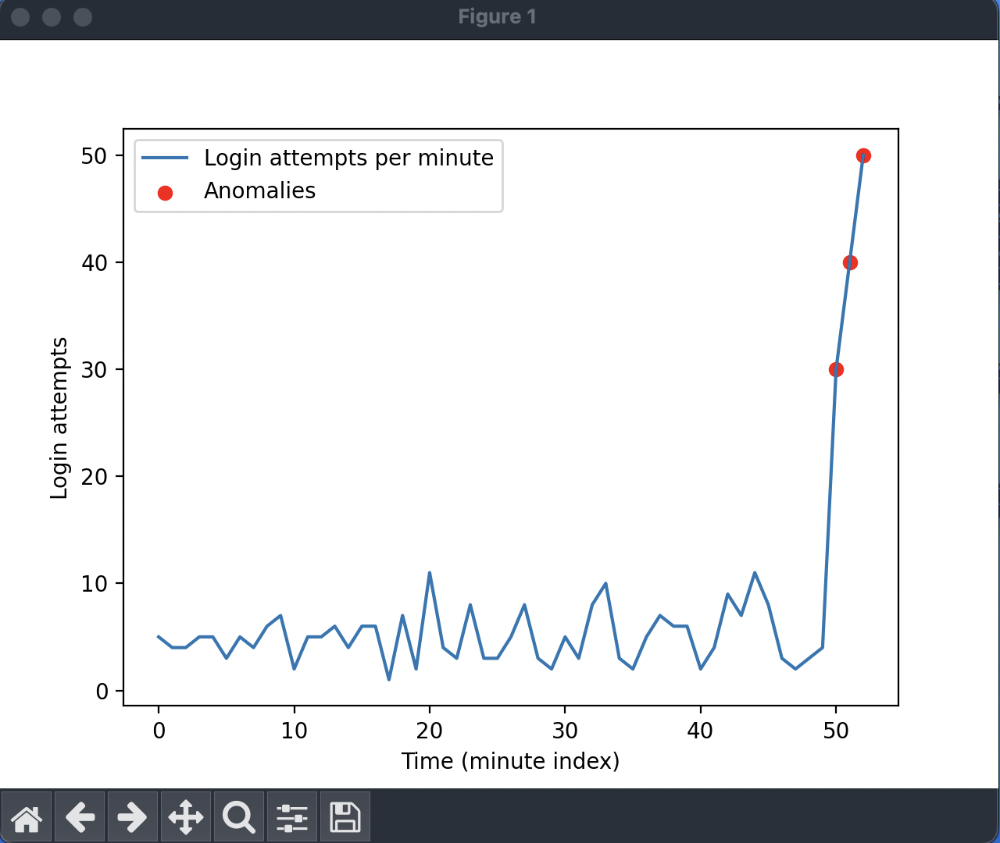

# SIEM system - Log analysis and Anomaly detection  

This is a basic AI-powered SIEM component that ingests log data, analyzes it for anomalies using a machine learning model, and indentifies unusual events that could represent security threats.

In this app, we simulate login attempts, and analyze them to find anomalies (a big number of login attempts per minute).

## Setup

```bash
    # Install dependencies
    pip install -r requirements.txt
```

## Visualization

